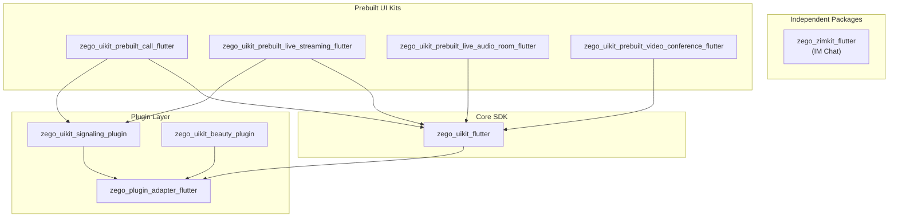

# ZegoUIKit Flutter Architecture

> Core SDK - the底层依赖 for all Zego UIKit Flutter packages

## Overview

`zego_uikit_flutter` is Zego's core SDK for audio/video communication, providing foundational capabilities:
- Audio/video room management
- User/stream management
- Device control (camera, microphone, speaker)
- Media playback/recording
- Message channels
- Plugin extensions

All upper-level Prebuilt packages (call, live_streaming, video_conference, etc.) depend on this package.

## Package Dependencies

```
zego_uikit_flutter
├── zego_plugin_adapter        # Plugin adapter layer
├── zego_express_engine        # Low-level audio/video engine
├── flutter_logs_yoer          # Logging
├── cached_network_image       # Image caching
├── permission_handler         # Permission management
└── ... (other utilities)
```

## Package Relationship Diagram



## Core Pattern: Singleton Factory + Mixins

The core class `ZegoUIKit()` is a **factory singleton** that combines multiple services via `mixin`:

```dart
class ZegoUIKit
    with
        ZegoAudioVideoService,
        ZegoRoomService,
        ZegoUserService,
        ZegoChannelService,
        ZegoMessageService,
        ZegoCustomCommandService,
        ZegoDeviceService,
        ZegoEffectService,
        ZegoPluginService,
        ZegoMediaService,
        ZegoMixerService,
        ZegoEventService,
        ZegoLoggerService {
  factory ZegoUIKit() => instance;
}
```

Each mixin corresponds to a service domain, defined in the `lib/src/services/` directory.

## Quick Start

```dart
import 'package:zego_uikit/zego_uikit.dart';

// 1. Initialize (call once before using any features)
await ZegoUIKit().init(
  appID: yourAppID,
  appSign: yourAppSign,
  scenario: ZegoScenario.Default,
);

// 2. Join room
await ZegoUIKit().joinRoom(roomID);

// 3. Leave room
await ZegoUIKit().leaveRoom();

// 4. Uninit (on app exit)
await ZegoUIKit().uninit();
```

## Service Mixins

| Mixin | File | Purpose |
|-------|------|---------|
| `ZegoAudioVideoService` | `audio_video_service.dart` | Audio/video stream management, playback control |
| `ZegoRoomService` | `room_service.dart` | Room login/logout, room properties |
| `ZegoUserService` | `user_service.dart` | User management, user list |
| `ZegoDeviceService` | `device_service.dart` | Camera, microphone, speaker control |
| `ZegoMessageService` | `message_service.dart` | In-room message sending/receiving |
| `ZegoChannelService` | `channel_service.dart` | Custom signaling channel |
| `ZegoCustomCommandService` | `custom_command_service.dart` | Custom commands |
| `ZegoMediaService` | `media_service.dart` | Media player, recording |
| `ZegoMixerService` | `mixer_service.dart` | Stream mixing service |
| `ZegoEffectService` | `effect_service.dart` | Sound effect playback |
| `ZegoPluginService` | `plugin_service.dart` | Plugin management |
| `ZegoEventService` | `event_service.dart` | Event subscription |
| `ZegoLoggerService` | `logger_service.dart` | Log output |

## Common API Examples

### Room Service

```dart
// Join room
final result = await ZegoUIKit().joinRoom(
  roomID,
  token: 'your_token',  // Optional, can be omitted with AppSign
  markAsLargeRoom: false,
  keepWakeScreen: true,
);

// Get room state stream
ZegoUIKit().getRoomStateStream().listen((state) {
  switch (state) {
    case ZegoUIKitRoomState.connecting:
      print('Connecting...');
    case ZegoUIKitRoomState.connected:
      print('Connected');
    case ZegoUIKitRoomState.disconnected:
      print('Disconnected');
  }
});

// Leave room
await ZegoUIKit().leaveRoom();

// Get current room
final room = ZegoUIKit().getRoom();
print('Room ID: ${room.id}');
```

### Audio/Video Service

```dart
// Start playing all audio/video
await ZegoUIKit().startPlayAllAudioVideo();

// Stop playing all audio/video
await ZegoUIKit().stopPlayAllAudioVideo();

// Mute specific user
await ZegoUIKit().muteUserAudioVideo(userID, true);

// Set audio output to speaker
ZegoUIKit().setAudioOutputToSpeaker(true);

// Set audio config
await ZegoUIKit().setAudioConfig(
  ZegoUIKitAudioConfig.configHighQuality(),
  streamType: ZegoStreamType.main,
);

// 3A Audio Processing
ZegoUIKit().enableAEC(true);      // Echo cancellation
ZegoUIKit().enableAGC(true);      // Auto gain control
ZegoUIKit().enableANS(true);      // Noise suppression
```

### User Service

```dart
// Get all users
final users = ZegoUIKit().getAllUsers();

// Get user by ID
final user = ZegoUIKit().getUser(userID);

// Listen for user join/leave
ZegoUIKit().getUserJoinStream().listen((user) {
  print('User joined: ${user.name}');
});

ZegoUIKit().getUserLeaveStream().listen((user) {
  print('User left: ${user.name}');
});
```

### Device Service

```dart
// Toggle camera
await ZegoUIKit().openCamera();
await ZegoUIKit().closeCamera();

// Toggle microphone
await ZegoUIKit().startMicrophone();
await ZegoUIKit().stopMicrophone();

// Toggle speaker
await ZegoUIKit().enableSpeaker(true);

// Get device list
final cameras = await ZegoUIKit().getCameras();
final microphones = await ZegoUIKit().getMicrophones();
final speakers = await ZegoUIKit().getSpeakers();

// Switch device
await ZegoUIKit().useDeviceAsCamera(deviceID);
await ZegoUIKit().useDeviceAsMicrophone(deviceID);
await ZegoUIKit().useDeviceAsSpeaker(deviceID);
```

## Directory Structure

```
lib/
├── zego_uikit.dart              # Main entry, exports all public APIs
└── src/
    ├── defines.dart             # Public defines (exports services/defines/)
    ├── components/              # UI components
    │   ├── components.dart
    │   ├── audio_video/          # Audio/video views
    │   │   ├── audio_video.dart
    │   │   └── defines.dart
    │   ├── audio_video_container/ # Audio/video containers (Grid/PiP layouts)
    │   │   ├── audio_video_container.dart
    │   │   ├── layout_gallery.dart
    │   │   └── layout_picture_in_picture.dart
    │   ├── effect/              # Beauty effect sliders
    │   │   └── beauty_effect_slider.dart
    │   ├── member/              # Member list
    │   │   └── member_list.dart
    │   ├── message/             # Message views
    │   │   └── message.dart
    │   ├── widgets/             # Common widgets
    │   ├── leave_button.dart
    │   ├── functions.dart
    │   └── theme.dart
    ├── plugins/                 # Plugin extensions
    │   ├── plugins.dart
    │   ├── beauty/              # Beauty plugin implementation
    │   └── signaling/           # Signaling plugin implementation
    ├── services/                # Core services (mixins)
    │   ├── services.dart        # Exports all service defines
    │   ├── uikit_service.dart   # ZegoUIKit main class definition
    │   ├── audio_video_service.dart
    │   ├── room_service.dart
    │   ├── user_service.dart
    │   ├── device_service.dart
    │   ├── message_service.dart
    │   ├── channel_service.dart
    │   ├── media_service.dart
    │   ├── mixer_service.dart
    │   ├── effect_service.dart
    │   ├── plugin_service.dart
    │   ├── custom_command_service.dart
    │   ├── event_service.dart
    │   ├── logger_service.dart
    │   ├── user_cache.dart
    │   ├── defines/             # Service-related defines
    │   │   ├── audio_video.dart
    │   │   ├── room.dart
    │   │   ├── user.dart
    │   │   ├── device.dart
    │   │   ├── media.dart
    │   │   ├── message.dart
    │   │   ├── effect.dart
    │   │   └── ...
    │   └── internal/            # Service internal utilities
    ├── channel/                 # Platform channel
    │   ├── method_channel.dart
    │   └── platform_interface.dart
    └── modules/                 # Extension modules
        └── outside_room_audio_video/  # Outside-room audio/video
```

## Core Classes

### ZegoUIKit (Main Entry)

Complete usage flow:

```dart
void main() async {
  WidgetsFlutterBinding.ensureInitialized();

  // 1. Initialize (call before using any features)
  await ZegoUIKit().init(
    appID: yourAppID,
    appSign: yourAppSign,
    scenario: ZegoScenario.Default,
  );

  runApp(MyApp());
}

// Usage in page
class CallPage extends StatelessWidget {
  @override
  Widget build(BuildContext context) {
    // Join room
    ZegoUIKit().joinRoom('room_123');

    // Listen for errors
    ZegoUIKit().getErrorStream().listen((error) {
      print('Error: ${error.code} - ${error.message}');
    });

    return Scaffold(
      body: Center(child: Text('In Call')),
    );
  }
}
```

### Key Defines

| Class | Purpose |
|-------|---------|
| `ZegoUIKitRoom` | Room information |
| `ZegoUIKitUser` | User information |
| `ZegoUIKitStream` | Stream information |
| `ZegoUIKitAudioConfig` | Audio configuration |
| `ZegoUIKitRoomState` | Room state enum |

### Room State Enum

```dart
enum ZegoUIKitRoomState {
  connecting,   // Connecting
  connected,    // Connected
  reconnecting, // Reconnecting
  disconnected, // Disconnected
}
```

## Plugin System

`zego_uikit_flutter` provides plugin extensibility through `ZegoPluginService`:

```dart
// Register plugin
ZegoUIKit().registerPlugin(ZegoBeautyPlugin());

// Use plugin
ZegoUIKit().getPlugin(BeautyPlugin.key);
```

Built-in plugins:
- `zego_uikit_beauty_plugin_flutter` - Beauty plugin
- `zego_uikit_signaling_plugin_flutter` - Signaling plugin

## Platform Channel

Low-level communication via `MethodChannel`:

```
lib/src/channel/
├── method_channel.dart        # Flutter side channel
└── platform_interface.dart    # Abstract interface
```

## Logging Pattern

Use `ZegoLoggerService` for logging:

```dart
ZegoLoggerService.logInfo('message', tag: 'uikit', subTag: 'audio');
ZegoLoggerService.logWarn('warning', tag: 'uikit', subTag: 'audio');
ZegoLoggerService.logError('error', tag: 'uikit', subTag: 'audio');
```

Log levels:
- `logInfo` - General info
- `logWarn` - Warning
- `logError` - Error

## Code Conventions

### Import Order

Organize by groups with blank lines between groups:
```dart
// Dart imports:
import 'dart:async';

// Flutter imports:
import 'package:flutter/material.dart';

// Package imports:
import 'package:zego_uikit/zego_uikit.dart';

// Project imports:
import 'package:my_app/utils.dart';
```

### Documentation

All public members require documentation comments:

```dart
/// Gets the current room's ID
///
/// Returns:
///   Room ID string, returns empty string if not in a room
String get roomID => ZegoUIKitCore.shared.coreData.room.id;
```

### Naming Conventions

| Type | Rule | Example |
|------|------|---------|
| Class/Enum | PascalCase | `ZegoUIKitRoom`, `ZegoRoomState` |
| Method/Variable | camelCase | `joinRoom`, `userID` |
| Constant | camelCase | `maxUsers`, `defaultTimeout` |
| File | snake_case | `room_service.dart` |
| Mixin | PascalCase, ends with Service | `ZegoRoomService` |

## Common Issues & Solutions

### 1. Must Call on Main Thread

ZegoUIKit methods need to be executed on the main thread:

```dart
SchedulerBinding.instance.scheduleTask(() async {
  await ZegoUIKit().joinRoom(roomID);
}, Priority.high);
```

### 2. Init Before Use

`init()` must be called before any other API calls:

```dart
// ✓ Correct
await ZegoUIKit().init(...);
await ZegoUIKit().joinRoom(...);

// ✗ Wrong - will crash
await ZegoUIKit().joinRoom(...);  // Not initialized
await ZegoUIKit().init(...);
```

### 3. Room ID Uniqueness

You can only be in one room at a time. Leave before joining another:

```dart
// Switch rooms
await ZegoUIKit().leaveRoom();  // Leave current room first
await ZegoUIKit().joinRoom(newRoomID);
```

### 4. Token Expiration Handling

Listen for token expiration events and update:

```dart
ZegoUIKit().getRoomTokenExpiredStream().listen((roomID) async {
  final newToken = await fetchNewToken(roomID);
  await ZegoUIKit().renewRoomToken(newToken);
});
```

## Upstream Package Integration

Prebuilt packages access underlying capabilities through `ZegoUIKit`:

```dart
// Internal implementation in zego_uikit_prebuilt_call_flutter
class ZegoUIKitPrebuiltCallController {
  void someMethod() {
    // Call underlying capabilities
    ZegoUIKit().joinRoom(roomID);
    ZegoUIKit().getUser(userID);
  }
}
```

## Related Documentation

- [ZegoUIKitPrebuiltCall Architecture](../zego_uikit_prebuilt_call_flutter/ARCHITECTURE.md)
- [ZegoUIKitPrebuiltLiveStreaming Architecture](../zego_uikit_prebuilt_live_streaming_flutter/ARCHITECTURE.md)
- [ZegoPluginAdapter Architecture](../zego_plugin_adapter_flutter/ARCHITECTURE.md)
