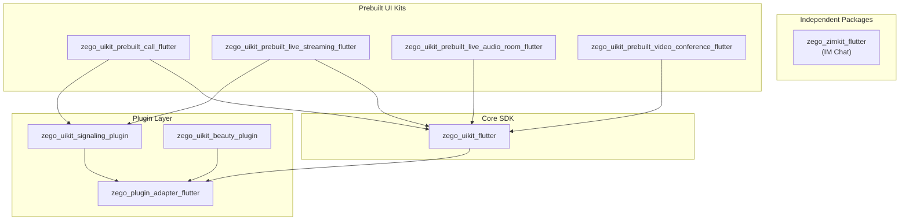

# ZegoUIKit Flutter Architecture

> 核心SDK，所有 Zego UIKit Flutter 包的底层依赖

## Overview

`zego_uikit_flutter` 是 Zego 音视频通信的**核心SDK**，提供底层能力：
- 音视频房间管理
- 用户/流管理
- 设备控制（摄像头、麦克风、扬声器）
- 媒体播放/录制
- 消息通道
- 插件扩展

所有上层 Prebuilt 包（call、live_streaming、video_conference 等）都依赖此包。

## Package Dependencies

```
zego_uikit_flutter
├── zego_plugin_adapter        # 插件适配层
├── zego_express_engine        # 底层音视频引擎
├── flutter_logs_yoer          # 日志
├── cached_network_image       # 图片缓存
├── permission_handler         # 权限管理
└── ... (其他工具库)
```

## Package Relationship Diagram



## Core Pattern: Singleton Factory + Mixins

核心类 `ZegoUIKit()` 是一个**工厂单例**，通过 `mixin` 组合多个服务：

```dart
class ZegoUIKit
    with
        ZegoAudioVideoService,
        ZegoRoomService,
        ZegoUserService,
        ZegoChannelService,
        ZegoMessageService,
        ZegoCustomCommandService,
        ZegoDeviceService,
        ZegoEffectService,
        ZegoPluginService,
        ZegoMediaService,
        ZegoMixerService,
        ZegoEventService,
        ZegoLoggerService {
  factory ZegoUIKit() => instance;
}
```

每个 mixin 对应一个服务领域，定义在 `lib/src/services/` 目录下。

## Quick Start

```dart
import 'package:zego_uikit/zego_uikit.dart';

// 1. 初始化 (在使用任何功能前调用一次)
await ZegoUIKit().init(
  appID: yourAppID,
  appSign: yourAppSign,
  scenario: ZegoScenario.Default,
);

// 2. 加入房间
await ZegoUIKit().joinRoom(roomID);

// 3. 离开房间
await ZegoUIKit().leaveRoom();

// 4. 反初始化 (App 退出时)
await ZegoUIKit().uninit();
```

## Service Mixins

| Mixin | File | Purpose |
|-------|------|---------|
| `ZegoAudioVideoService` | `audio_video_service.dart` | 音视频流管理、播放控制 |
| `ZegoRoomService` | `room_service.dart` | 房间登录/退出、房间属性 |
| `ZegoUserService` | `user_service.dart` | 用户管理、用户列表 |
| `ZegoDeviceService` | `device_service.dart` | 摄像头、麦克风、扬声器控制 |
| `ZegoMessageService` | `message_service.dart` | 房间内消息发送/接收 |
| `ZegoChannelService` | `channel_service.dart` | 自定义信令通道 |
| `ZegoCustomCommandService` | `custom_command_service.dart` | 自定义命令 |
| `ZegoMediaService` | `media_service.dart` | 媒体播放器、录制 |
| `ZegoMixerService` | `mixer_service.dart` | 混流服务 |
| `ZegoEffectService` | `effect_service.dart` | 音效播放 |
| `ZegoPluginService` | `plugin_service.dart` | 插件管理 |
| `ZegoEventService` | `event_service.dart` | 事件订阅 |
| `ZegoLoggerService` | `logger_service.dart` | 日志输出 |

## Common API Examples

### Room Service

```dart
// 加入房间
final result = await ZegoUIKit().joinRoom(
  roomID,
  token: 'your_token',  // 可选，有 AppSign 时可省略
  markAsLargeRoom: false,
  keepWakeScreen: true,
);

// 获取房间状态流
ZegoUIKit().getRoomStateStream().listen((state) {
  switch (state) {
    case ZegoUIKitRoomState.connecting:
      print('Connecting...');
    case ZegoUIKitRoomState.connected:
      print('Connected');
    case ZegoUIKitRoomState.disconnected:
      print('Disconnected');
  }
});

// 离开房间
await ZegoUIKit().leaveRoom();

// 获取当前房间
final room = ZegoUIKit().getRoom();
print('Room ID: ${room.id}');
```

### Audio/Video Service

```dart
// 开启所有音频视频
await ZegoUIKit().startPlayAllAudioVideo();

// 停止所有音频视频
await ZegoUIKit().stopPlayAllAudioVideo();

// 静音指定用户
await ZegoUIKit().muteUserAudioVideo(userID, true);

// 设置音频输出到扬声器
ZegoUIKit().setAudioOutputToSpeaker(true);

// 设置音频配置
await ZegoUIKit().setAudioConfig(
  ZegoUIKitAudioConfig.configHighQuality(),
  streamType: ZegoStreamType.main,
);

// 3A 音频处理
ZegoUIKit().enableAEC(true);      // 回声消除
ZegoUIKit().enableAGC(true);      // 自动增益
ZegoUIKit().enableANS(true);      // 噪音抑制
```

### User Service

```dart
// 获取用户列表
final users = ZegoUIKit().getAllUsers();

// 按 ID 获取用户
final user = ZegoUIKit().getUser(userID);

// 用户加入/离开监听
ZegoUIKit().getUserJoinStream().listen((user) {
  print('User joined: ${user.name}');
});

ZegoUIKit().getUserLeaveStream().listen((user) {
  print('User left: ${user.name}');
});
```

### Device Service

```dart
// 开关摄像头
await ZegoUIKit().openCamera();
await ZegoUIKit().closeCamera();

// 开关麦克风
await ZegoUIKit().startMicrophone();
await ZegoUIKit().stopMicrophone();

// 开关扬声器
await ZegoUIKit().enableSpeaker(true);

// 获取设备列表
final cameras = await ZegoUIKit().getCameras();
final microphones = await ZegoUIKit().getMicrophones();
final speakers = await ZegoUIKit().getSpeakers();

// 切换设备
await ZegoUIKit().useDeviceAsCamera(deviceID);
await ZegoUIKit().useDeviceAsMicrophone(deviceID);
await ZegoUIKit().useDeviceAsSpeaker(deviceID);
```

## Directory Structure

```
lib/
├── zego_uikit.dart              # 主入口，export 所有公共API
└── src/
    ├── defines.dart             # 公共定义（export services/defines/）
    ├── components/              # UI 组件
    │   ├── components.dart
    │   ├── audio_video/          # 音视频视图
    │   │   ├── audio_video.dart
    │   │   └── defines.dart
    │   ├── audio_video_container/ # 音视频容器（Grid/PiP布局）
    │   │   ├── audio_video_container.dart
    │   │   ├── layout_gallery.dart
    │   │   └── layout_picture_in_picture.dart
    │   ├── effect/              # 美颜效果滑块
    │   │   └── beauty_effect_slider.dart
    │   ├── member/              # 成员列表
    │   │   └── member_list.dart
    │   ├── message/             # 消息视图
    │   │   └── message.dart
    │   ├── widgets/             # 通用 widgets
    │   ├── leave_button.dart
    │   ├── functions.dart
    │   └── theme.dart
    ├── plugins/                 # 插件扩展
    │   ├── plugins.dart
    │   ├── beauty/              # 美颜插件实现
    │   └── signaling/           # 信令插件实现
    ├── services/                # 核心服务（mixins）
    │   ├── services.dart        # export 所有 service defines
    │   ├── uikit_service.dart   # ZegoUIKit 主类定义
    │   ├── audio_video_service.dart
    │   ├── room_service.dart
    │   ├── user_service.dart
    │   ├── device_service.dart
    │   ├── message_service.dart
    │   ├── channel_service.dart
    │   ├── media_service.dart
    │   ├── mixer_service.dart
    │   ├── effect_service.dart
    │   ├── plugin_service.dart
    │   ├── custom_command_service.dart
    │   ├── event_service.dart
    │   ├── logger_service.dart
    │   ├── user_cache.dart
    │   ├── defines/             # 服务相关定义
    │   │   ├── audio_video.dart
    │   │   ├── room.dart
    │   │   ├── user.dart
    │   │   ├── device.dart
    │   │   ├── media.dart
    │   │   ├── message.dart
    │   │   ├── effect.dart
    │   │   └── ...
    │   └── internal/            # 服务内部工具
    ├── channel/                 # 平台通道
    │   ├── method_channel.dart
    │   └── platform_interface.dart
    └── modules/                 # 扩展模块
        └── outside_room_audio_video/  # 房间外音视频
```

## Core Classes

### ZegoUIKit (主入口)

完整使用流程：

```dart
void main() async {
  WidgetsFlutterBinding.ensureInitialized();

  // 1. 初始化 (在使用任何功能前调用)
  await ZegoUIKit().init(
    appID: yourAppID,
    appSign: yourAppSign,
    scenario: ZegoScenario.Default,
  );

  runApp(MyApp());
}

// 在页面中使用
class CallPage extends StatelessWidget {
  @override
  Widget build(BuildContext context) {
    // 加入房间
    ZegoUIKit().joinRoom('room_123');

    // 监听错误
    ZegoUIKit().getErrorStream().listen((error) {
      print('Error: ${error.code} - ${error.message}');
    });

    return Scaffold(
      body: Center(child: Text('In Call')),
    );
  }
}
```

### Key Defines

| Class | Purpose |
|-------|---------|
| `ZegoUIKitRoom` | 房间信息 |
| `ZegoUIKitUser` | 用户信息 |
| `ZegoUIKitStream` | 流信息 |
| `ZegoUIKitAudioConfig` | 音频配置 |
| `ZegoUIKitRoomState` | 房间状态枚举 |

### Room State Enum

```dart
enum ZegoUIKitRoomState {
  connecting,   // 连接中
  connected,    // 已连接
  reconnecting, // 重连中
  disconnected, // 已断开
}
```

## Plugin System

`zego_uikit_flutter` 通过 `ZegoPluginService` 提供插件扩展能力：

```dart
// 注册插件
ZegoUIKit().registerPlugin(ZegoBeautyPlugin());

// 使用插件
ZegoUIKit().getPlugin(BeautyPlugin.key);
```

内置插件：
- `zego_uikit_beauty_plugin_flutter` - 美颜插件
- `zego_uikit_signaling_plugin_flutter` - 信令插件

## Platform Channel

底层通信通过 `MethodChannel` 实现：

```
lib/src/channel/
├── method_channel.dart        # Flutter 端通道
└── platform_interface.dart    # 抽象接口
```

## Logging Pattern

使用 `ZegoLoggerService` 进行日志记录：

```dart
ZegoLoggerService.logInfo('message', tag: 'uikit', subTag: 'audio');
ZegoLoggerService.logWarn('warning', tag: 'uikit', subTag: 'audio');
ZegoLoggerService.logError('error', tag: 'uikit', subTag: 'audio');
```

日志级别：
- `logInfo` - 一般信息
- `logWarn` - 警告
- `logError` - 错误

## Code Conventions

### Import Order

按分组顺序排列，组间空行分隔：
```dart
// Dart imports:
import 'dart:async';

// Flutter imports:
import 'package:flutter/material.dart';

// Package imports:
import 'package:zego_uikit/zego_uikit.dart';

// Project imports:
import 'package:my_app/utils.dart';
```

### Documentation

所有公开成员需要文档注释：

```dart
/// 获取当前房间的 ID
///
/// Returns:
///   房间 ID 字符串，如果未在房间中则返回空字符串
String get roomID => ZegoUIKitCore.shared.coreData.room.id;
```

### Naming Conventions

| 类型 | 规则 | 示例 |
|------|------|------|
| 类/枚举 | PascalCase | `ZegoUIKitRoom`, `ZegoRoomState` |
| 方法/变量 | camelCase | `joinRoom`, `userID` |
| 常量 | camelCase | `maxUsers`, `defaultTimeout` |
| 文件 | snake_case | `room_service.dart` |
| Mixin | PascalCase，以 Service 结尾 | `ZegoRoomService` |

## Common Issues & Solutions

### 1. 必须在主线程调用

ZegoUIKit 方法需要在主线程执行，使用 `SchedulerBinding.instance.scheduleTask`：

```dart
SchedulerBinding.instance.scheduleTask(() async {
  await ZegoUIKit().joinRoom(roomID);
}, Priority.high);
```

### 2. 先 init 再使用

`init()` 必须先于任何其他 API 调用：

```dart
// ✓ 正确
await ZegoUIKit().init(...);
await ZegoUIKit().joinRoom(...);

// ✗ 错误 - 会崩溃
await ZegoUIKit().joinRoom(...);  // 未 init
await ZegoUIKit().init(...);
```

### 3. 房间ID唯一性

同时只能在一个房间中，切换房间需先离开：

```dart
// 切换房间
await ZegoUIKit().leaveRoom();  // 先离开当前房间
await ZegoUIKit().joinRoom(newRoomID);
```

### 4. Token 过期处理

监听 Token 过期事件并更新：

```dart
ZegoUIKit().getRoomTokenExpiredStream().listen((roomID) async {
  final newToken = await fetchNewToken(roomID);
  await ZegoUIKit().renewRoomToken(newToken);
});
```

## Upstream Package Integration

各 Prebuilt 包通过 `ZegoUIKit` 访问底层能力：

```dart
// zego_uikit_prebuilt_call_flutter 内部实现
class ZegoUIKitPrebuiltCallController {
  void someMethod() {
    // 调用底层能力
    ZegoUIKit().joinRoom(roomID);
    ZegoUIKit().getUser(userID);
  }
}
```

## Related Documentation

- [ZegoUIKitPrebuiltCall Architecture](../zego_uikit_prebuilt_call_flutter/ARCHITECTURE.md)
- [ZegoUIKitPrebuiltLiveStreaming Architecture](../zego_uikit_prebuilt_live_streaming_flutter/ARCHITECTURE.md)
- [ZegoPluginAdapter Architecture](../zego_plugin_adapter_flutter/ARCHITECTURE.md)